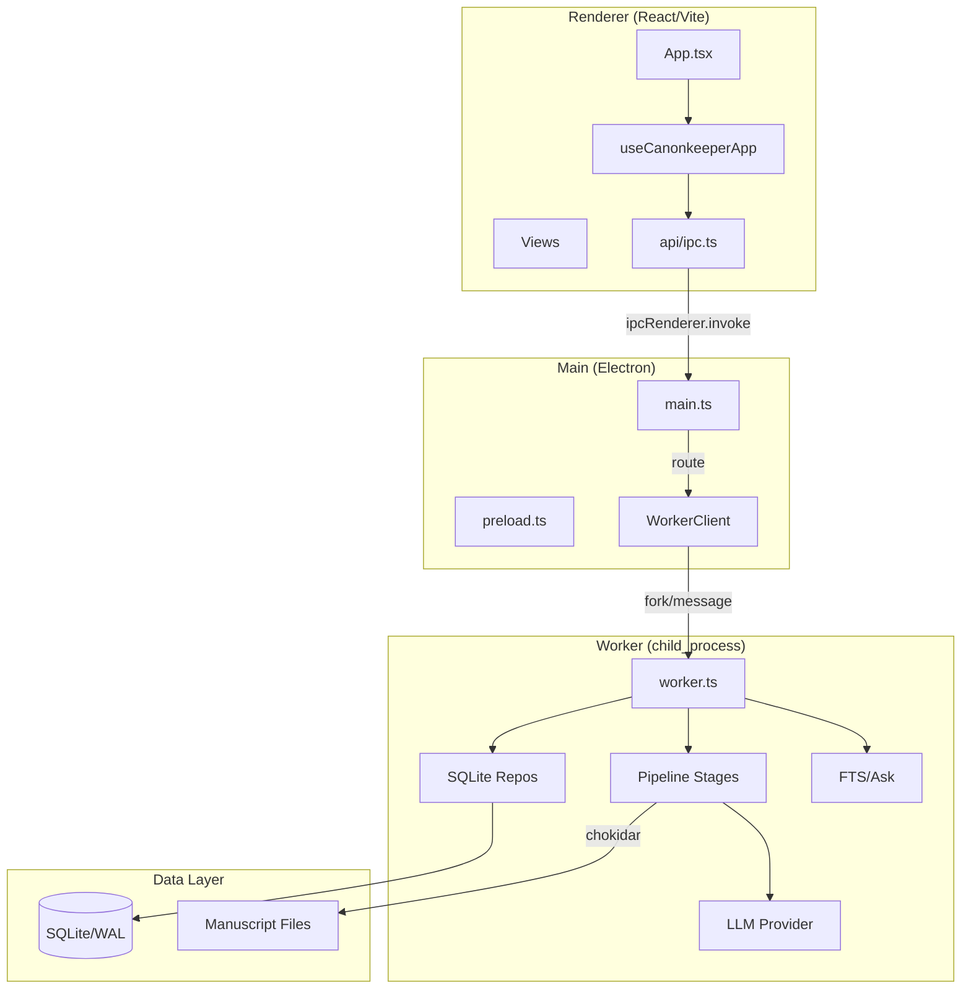
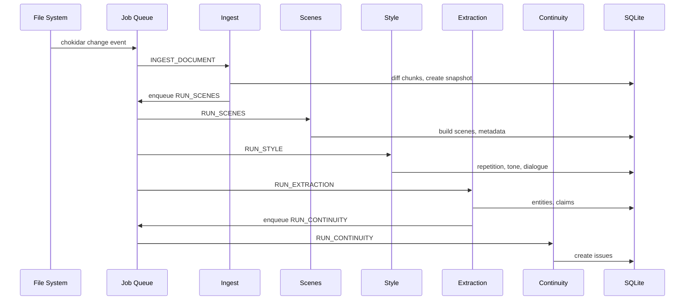

# Codebase Map

> Auto-generated by Cartographer. Last mapped: 2026-02-06T23:28:10Z

## System Overview

CanonKeeper is a local-first Electron desktop app for fiction writers. It ingests manuscripts **read-only** and produces evidence-backed editorial diagnostics (Characters & World, scene index, style analysis, continuity issues, Q&A).



### Process Model (Three Processes)

| Process | Role | Entry Point |
|---------|------|-------------|
| **Renderer** | React UI only; all data via IPC | `renderer/src/main.tsx` |
| **Main** | Window lifecycle, IPC routing, dialogs | `electron/main.ts` |
| **Worker** | SQLite, pipeline, LLM, search, export | `electron/worker/worker.ts` |

### IPC Flow

```
Renderer → ipcRenderer.invoke() → Main (ipcMain) → WorkerClient.invoke() → Worker
Worker → process.send(RpcResponse) → Main → ipcMain resolve → Renderer
```

## Directory Structure

```
canon-keeper/
├── apps/desktop/
│   ├── electron/                 # Main + Worker processes
│   │   ├── main.ts              # Electron entry, window, IPC bridge
│   │   ├── preload.ts           # Secure IPC API (window.canonkeeper)
│   │   └── worker/
│   │       ├── worker.ts        # RPC dispatcher, session lifecycle
│   │       ├── client.ts        # Main→Worker IPC with auto-restart
│   │       ├── rpc.ts           # RPC type definitions
│   │       ├── config.ts        # canonkeeper.json management
│   │       ├── pipeline/        # Ingestion & analysis stages
│   │       │   ├── stages/      # Stage wrappers (idempotency)
│   │       │   └── style/       # Repetition, tone, dialogue
│   │       ├── storage/         # SQLite repositories
│   │       ├── jobs/            # PersistentJobQueue
│   │       ├── llm/             # Provider abstraction
│   │       ├── search/          # FTS + Q&A
│   │       └── export/          # Markdown/JSON export
│   └── renderer/                # React UI
│       └── src/
│           ├── App.tsx          # Shell + view routing
│           ├── api/ipc.ts       # IPC client functions
│           ├── state/           # useCanonkeeperApp hook
│           ├── views/           # 9 view components
│           ├── components/      # 17 UI components
│           └── context/         # Theme provider
├── packages/shared/             # Cross-process types & utils
│   ├── types/persisted.ts       # All SQLite row types
│   ├── utils/                   # hashing, normalize, spans
│   └── schemas/                 # JSON schemas for LLM
├── migrations/                  # SQLite migrations (001-009)
├── data/fixtures/               # Test manuscripts
└── docs/                        # Documentation & artifacts
```

## Module Guide

### Electron Main Process

#### `electron/main.ts`
**Purpose**: Electron app entry, window lifecycle, IPC bridge to worker
**Entry point**: App startup
**Key exports**: `createWindow()`
**Dependencies**: `WorkerClient`, `BrowserWindow`
**Patterns**: All `ipcMain.handle()` delegates to `workerClient.request()`

#### `electron/preload.ts`
**Purpose**: Secure IPC bridge exposing `window.canonkeeper` API
**Key exports**: `window.canonkeeper.*` namespaced methods
**Patterns**: `contextBridge.exposeInMainWorld` for security

### Worker Process Core

#### `electron/worker/worker.ts`
**Purpose**: Worker main loop, RPC dispatcher, session/project lifecycle
**Key exports**: `dispatch(method, params)`, `handleJob(job)`
**Dependencies**: All storage repos, pipeline stages, search, export
**Patterns**:
- Sequential pipeline: `INGEST → SCENES → STYLE → EXTRACTION → CONTINUITY`
- File watcher (chokidar) debounces changes 2s before re-ingesting
- Session singleton (opening new project tears down previous)

#### `electron/worker/client.ts`
**Purpose**: Main→Worker IPC with auto-restart, exponential backoff
**Key exports**: `WorkerClient` class
**Patterns**:
- Buffers requests during restart, flushes on recovery
- 30s request timeout
- Re-opens last project after restart

### Pipeline Stages

| Stage | File | Purpose |
|-------|------|---------|
| **Ingest** | `pipeline/stages/ingest.ts` | Text extraction, chunking, incremental diff |
| **Scenes** | `pipeline/stages/scenes.ts` | Scene boundary detection + metadata |
| **Style** | `pipeline/stages/style.ts` | Repetition, tone drift, dialogue tics |
| **Extraction** | `pipeline/stages/extraction.ts` | Entity/claim discovery (deterministic + LLM) |
| **Continuity** | `pipeline/stages/continuity.ts` | Conflicting claim detection |

**Pipeline Flow**:


### Storage Layer (SQLite)

All access through repository pattern in `worker/storage/`:

| Repo | Table(s) | Purpose |
|------|----------|---------|
| `projectRepo` | `project` | Project metadata |
| `documentRepo` | `document` | Manuscript files |
| `snapshotRepo` | `snapshot` | Text version history |
| `chunkRepo` | `chunk`, `chunk_fts` | Text segments + FTS |
| `sceneRepo` | `scene`, `scene_entity` | Scene boundaries + metadata |
| `entityRepo` | `entity`, `entity_alias` | Characters, locations, objects |
| `claimRepo` | `claim` | Facts about entities |
| `issueRepo` | `issue`, `issue_evidence` | Continuity/style problems |
| `styleRepo` | `style_metric` | Repetition, tone metrics |

**Database**: SQLite with WAL mode, foreign keys enforced
**Migrations**: `migrations/001-009.sql`, auto-run on project open

### Renderer (React UI)

#### `App.tsx`
**Purpose**: Application shell with conditional view routing
**Patterns**: No router library; simple conditional rendering
**Key state**: `useCanonkeeperApp` hook manages all app state

#### `state/useCanonkeeperApp.ts`
**Purpose**: Master state hook - single source of truth
**Key features**:
- LocalStorage persistence (filters, selections, sidebar)
- Auto-refresh on worker idle (busy→idle transition)
- Global keyboard navigation (`[`, `]`, `j`, `k`, `Cmd+K`)
- Continue context (resume last issue/entity/scene)

#### Views (9 total)

| View | Purpose |
|------|---------|
| `DashboardView` | Activity status, continue actions, event log |
| `SetupView` | Onboarding wizard (project → document → diagnostics) |
| `SearchView` | FTS search + LLM Q&A |
| `ScenesView` | Scene index with POV/setting metadata |
| `IssuesView` | Continuity/style issue triage with filters |
| `StyleView` | Repetition table, tone drift, dialogue tics |
| `BibleView` | Characters & World with evidence-backed claims |
| `ExportView` | Markdown/JSON export |
| `SettingsView` | Runtime health, theme, diagnostics |

### Shared Package

| File | Purpose |
|------|---------|
| `types/persisted.ts` | All SQLite row types, enums |
| `utils/hashing.ts` | SHA-256 text hashing |
| `utils/normalize.ts` | Alias normalization |
| `utils/spans.ts` | Evidence span mapping (exact/fuzzy) |
| `schemas/*.json` | JSON schemas for LLM outputs |

## Data Flow

### File Change → Full Pipeline

```
1. chokidar 'change' → debounce 2s → enqueue INGEST_DOCUMENT
2. INGEST_DOCUMENT → diff chunks → snapshot created
3. If changes detected:
   - RUN_SCENES → build scenes + metadata
   - RUN_STYLE → repetition, tone, dialogue
   - RUN_EXTRACTION → entities, claims (deterministic + LLM)
4. RUN_EXTRACTION → touchedEntityIds → RUN_CONTINUITY
5. RUN_CONTINUITY → create issues for conflicts
```

### Renderer → Worker

```
Renderer: window.canonkeeper.scenes.list()
  → ipcRenderer.invoke("scenes:list")
Main: ipcMain.handle("scenes:list")
  → workerClient.request("scenes.list")
Worker: dispatch("scenes.list")
  → listScenesForProject(db)
  → process.send({ id, result })
Main: pending.resolve(response)
Renderer: receives scene list
```

## Conventions

### Code Style
- TypeScript strict mode, no `any`
- Prefer `const` over `let` (immutable-first)
- ESLint max-warnings=0, Prettier
- Repository pattern for storage
- Pipeline stages are idempotent (check processing_state)

### Naming
- Files: `camelCase.ts` for modules, `PascalCase.tsx` for components
- Types: `PascalCase` with `Row` suffix for DB types
- Functions: `verbNoun` pattern (`listScenes`, `insertClaim`)

### Evidence-First
- All claims require `evidence` spans (chunkId, quote, offsets)
- Items without evidence are hidden from UI
- Confirmed claims never overwritten by inference

## Gotchas

### Worker Process
- Session is singleton; opening new project tears down previous
- LLM is optional; app works fully with `NullProvider`
- `requireFromEsm` hack for loading better-sqlite3 in ESM context
- Native module ABI must match Node version (`bun install` to rebuild)

### Pipeline
- Evidence mapping required; LLM outputs discarded if spans don't map
- Confirmed claims supersede inferred claims (conflicts → issues)
- Style metrics cached per document; incremental on re-run

### Renderer
- No lazy loading of views (all imported eagerly)
- Unused context providers exist (`AppShellContext`, `EvidenceContext`, `ToastContext`)
- Types duplicated in `types.d.ts` and `ipc.ts`

### IPC
- Status subscription polls every 2s (no push events)
- Worker restart detected via `workerState` in status response
- 30s timeout per request

## Navigation Guide

**To add a new RPC method**:
1. Add method to `WorkerMethods` union in `worker/rpc.ts`
2. Add handler case in `dispatch()` in `worker/worker.ts`
3. Add preload bridge in `electron/preload.ts`
4. Add typed function in `renderer/src/api/ipc.ts`
5. Add type to `window.canonkeeper` in `renderer/src/types.d.ts`

**To add a new pipeline stage**:
1. Create stage function in `worker/pipeline/stages/`
2. Add job type to `worker/jobs/types.ts`
3. Add job handler case in `worker/worker.ts` `handleJob()`
4. Enqueue from previous stage or worker dispatch

**To add a new view**:
1. Create component in `renderer/src/views/`
2. Add section to `APP_SECTIONS` in `useCanonkeeperApp.ts`
3. Add conditional render in `App.tsx`
4. Add sidebar entry in `Sidebar.tsx`

**To add a new storage table**:
1. Create migration in `migrations/`
2. Create repository in `worker/storage/`
3. Add row types to `packages/shared/types/persisted.ts`
4. Export from `worker/storage/index.ts`

**To modify LLM prompts**:
1. Edit prompts in `worker/llm/promptPack.ts`
2. Update JSON schema in `packages/shared/schemas/`
3. Update extraction/scene-metadata handlers

## Testing

**Test Locations**: `apps/**/*.test.ts`, `packages/**/*.test.ts`
**Test Runner**: Vitest
**Global Setup**: `apps/desktop/electron/worker/testPreflight.ts`

```bash
# Run all tests (Dockerized)
bun run test

# Run locally
bun run test:local

# Single file
node ./node_modules/vitest/vitest.mjs run path/to/file.test.ts
```

## Build & Development

```bash
# Development
bun run dev              # Dockerized Vite dev server
bun run dev:local        # Local Electron stack

# Quality
bun run lint             # ESLint (max-warnings=0)
bun run typecheck        # tsc (desktop + shared)
bun run test             # Vitest

# Build
bun run build            # Dockerized build
bun run build:local      # Host build
```

**Runtime**: Node 25, Bun 1.2.23, ESM modules
**Pre-commit**: lefthook runs lint + typecheck
**Pre-push**: runs tests
